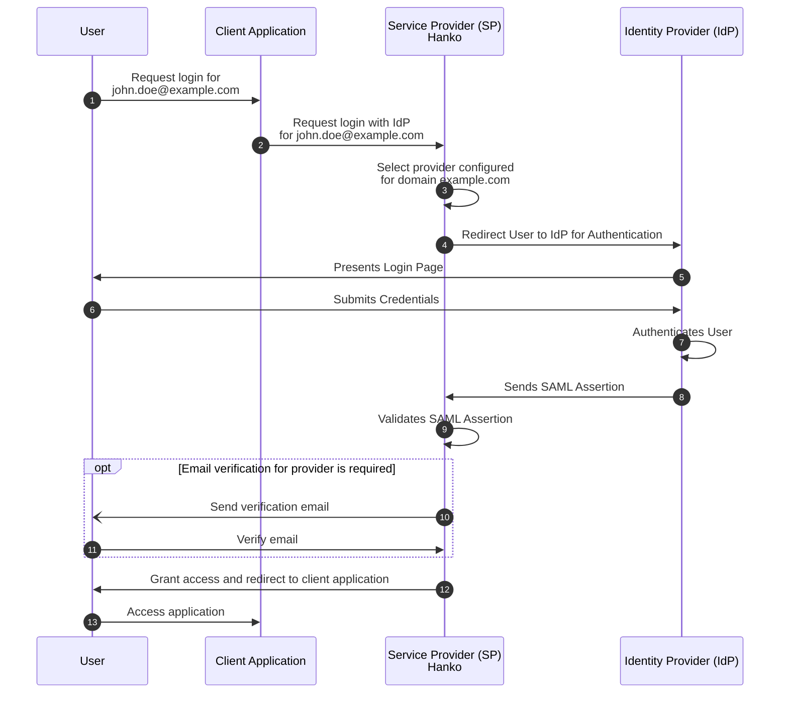
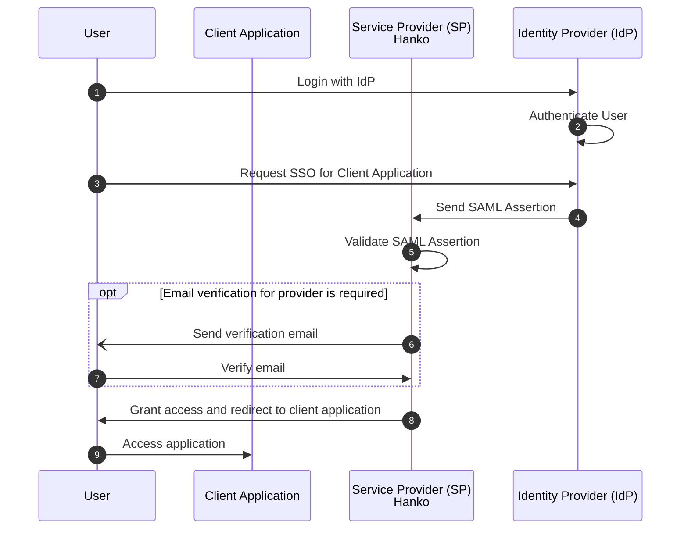

# Hanko SAML Integration Overview

**About Hanko**: Hanko is a modern, passwordless authentication solution that enables secure user login experiences through passkeys, SAML SSO, and other advanced authentication methods. This guide provides a comprehensive overview of SAML integration concepts and workflows with Hanko.

**What This Guide Covers**: This guide provides a comprehensive overview of SAML SSO enterprise connections, including setup concepts, authentication flows, security considerations, and account provisioning strategies.

**Key Technologies**: SAML 2.0, XML digital signatures, identity providers (IdP), service providers (SP), SSO workflows, enterprise connections, metadata configuration.

**Prerequisites**: Basic understanding of authentication concepts, Hanko Cloud account, familiarity with identity provider terminology, understanding of enterprise authentication requirements.

**Tasks You'll Complete**: 
- Understand SAML authentication flow types
- Learn enterprise connection configuration
- Explore SP-initiated vs IdP-initiated SSO flows
- Configure account provisioning and linking
- Review security considerations and limitations
- Access provider-specific integration guides

Security Assertion Markup Language (SAML) is an open standard for authentication and authorization that enables secure,
single sign-on (SSO) access to applications and services. By allowing identity providers (IdPs) to authenticate users
and pass authorization credentials to service providers (SPs), SAML enhances security, reduces password fatigue, and
improves user experience.

Hanko supports SAML SSO for any IdP compatible with the SAML 2.0 protocol.

<Info>
    This guide uses SAML 2.0 terminology. Consult the [glossary](#glossary) for unfamiliar terms.
</Info>

## Managing Enterprise Connections

A SAML SSO integration requires configuration at the Service Provider (SP, your Hanko project in this case) and
the Identity Provider (IdP).

### Adding an Enterprise Connection

To add an enterprise connection to your project:

1. Log in to [Hanko Cloud](https://cloud.hanko.io) and select your project.
2. Navigate to `Settings > Enterprise connections`.
3. Under `Connections`, click `New connection`.
4. In the shown modal provide the following data:
    -  A `Name` for the connection.
    -  A `Domain` for the connection. When users authenticate via SAML SSO, the domain of the email
       address provided as an identifier at the start of an authentication flow must match the domain configured here.
    -  A `Metadata URL`. This must be a URL pointing to a SAML 2.0 Metadata XML file containing the Identity Provider's
       metadata.
       <Warning>
           Hanko Cloud tenants currently do not support the upload of Metadata XML files. If your Identity Provider
           (IdP) does not offer a Metadata URL (e.g., Google) and instead only allows downloading a Metadata XML file,
           you must download this file, host it independently and publicly available, and provide the URL to the file.
       </Warning>
    -  Select whether you want skip email verification for this provider. If disabled, the Hanko tenant sends a
       verification email to the user's email address if no information about the verification status of a user's email
       address for the provider is discernible from SAML responses.
       <Warning>
           Hanko Cloud tenants currently do not support configuring mappings of SAML attributes from SAML responses
           to user properties at the Hanko tenant. If your providers' SAML responses can be configured to or do already
           include a SAML attribute with information about an verification status of an email address in a SAML
           response's attribute statement, then the tenant will currently ignore it. It is therefore recommended to not
           skip email verification to prevent hijacking of existing Hanko accounts by bad actors using unverified IdP
           addresses (see also: [Account provisioning and linking](#account-provisioning-and-linking))
       </Warning>

### Configuring SAML Identity Providers

The configuration required at an IdP varies by provider. While Hanko supports any SAML 2.0-compatible provider, the following providers have been officially tested:

- [Auth0](/guides/authentication-methods/saml/auth0)
- [Microsoft Entra ID](/guides/authentication-methods/saml/entra)
- [Google (Workspaces)](/guides/authentication-methods/saml/google)
- [Okta](/guides/authentication-methods/saml/okta)

## Using Enterprise Connections

Once you have set up a connection, users can authenticate via SAML SSO using either a
[Service Provider-initiated SSO](#service-provider-initiated-sso) or
an [Identity Provider-initiated SSO](#identity-provider-initiated-sso) flow.

The main difference between these two flow types is that in an SP-initiated SSO flow, the authentication process starts
when the user attempts to access a service, whereas in an IdP-initiated flow, the user begins the authentication process
at the IdP.

### Service Provider-Initiated SSO

The Service Provider-initiated (SP-initiated) flow begins with the Service Provider (SP - your Hanko Cloud tenant acting
as the Service Provider) initiating a SAML authentication request when attempting to access your client application,
rather than the user directly starting it with the IdP. It will automatically attempt to match the domain of a
user's email address provided as an identifier at the start of an authentication to the domain you configured for your
connection (see [Managing Enterprise Connections](#managing-enterprise-connections)) and then redirect to the IdP for
authentication.

1. The User requests access to your application and provides an email address as an identifier.
2. The authentication request is relayed to your Hanko Cloud tenant.
3. The Hanko API (which acts as a Service Provider (SP) in SAML terms) determines the Identity Provider (IdP) for the
   provided email address' domain.
4. The SP redirects the User to the IdP for authentication.
5. The IdP displays a login page to the User.
6. The User submits their credentials to the IdP.
7. The IdP authenticates the User.
8. Upon successful authentication, the IdP generates and sends a SAML Assertion back to the SP.
9. The SP validates the SAML Assertion.
10. _Optional_: If email verification for the provider is required, the SP sends a verification email to the User's
    email address.
11. _Optional_: The User verifies his email address.
12. Once validated and optional email verification was performed, the SP grants access and redirects the User to the
    Client Application.
13. The User accesses the Client Application.

### Identity Provider-Initiated SSO

In an Identity Provider-initiated (IdP-initiated) flow, the user begins at the Identity Provider (IdP), which could be
a login portal or a service like Google or Microsoft. After authentication with the IdP the user selects which service
or application they want to access.

1. The User accesses the IdP and requests a login.
2. The IdP authenticates the user.
3. The user requests access to a specific Client Application or Service.
4. The IdP generates and sends a SAML Assertion to the SP.
5. The SP validates the received SAML Assertion.
6. _Optional_: If email verification for the provider is required, the SP sends a verification email to the User's
email address.
7. _Optional_: The User verifies the email address.
8. Upon successful validation, the SP grants the user access to the requested service.
9. The User accesses the Client Application.

#### Security considerations

An IdP-initiated flow is inherently more insecure than an SP-initiated flow because it allows the IdP to send
SAML assertions directly to the SP (so-called _unsolicited_ SAML responses) without first verifying that the
user actually requested access to the SP. This increases the risk of unauthorized access if the IdP’s response is
intercepted or if there is a vulnerability in the IdP, as the SP has no prior context to ensure the user’s intent.

To mitigate the risks of IdP-initiated flows:

- Hanko ensures that unsolicited SAML responses do not contain an `InResponseTo` attribute (following section
  `4.1.5 Unsolicited Responses` of the
  [SAML 2.0 profiles specification](https://docs.oasis-open.org/security/saml/v2.0/saml-profiles-2.0-os.pdf)).
  This prevents malicious actors from intercepting a response used in an SP-initiated flow and reusing it in an
  IdP-initiated flow.
- To further mitigate the risk of replay of SAML responses, Hanko keeps track of all IdP-initiated SAML requests to
  ensure one-time use.

Because of the risks of the IdP-initiated it is recommended to use an SP-initiated flow instead.

## Account provisioning and linking

On a successful SAML SSO Hanko attempts to link Identity Provider (IdP) accounts to existing Hanko accounts based on
e-mail addresses:

- If no Hanko account with email address exists, then a new Hanko account is created and the IdP is linked to the
  newly created account.

  If you want to prevent this type of automatic account creation for your project, you can
  disable user self-service account creation and instead manually create or bulk import users through the console.
  <AccordionGroup>
      <Accordion title="Disabling self-service signup">
          1. Log in to [Hanko Cloud](https://cloud.hanko.io) and select your project.
          2. Navigate to `Settings > User account`.
          3. Find the `Account self-service` section.
          4. Use the `Allow Account creation` toggle enable or disable self-service account creation.
      </Accordion>

      <Accordion title="Creating or importing users">
            1. Log in to [Hanko Cloud](https://cloud.hanko.io) and select your project.
            2. Navigate to `Users`.
            3. On the top right, click
               - `Create new` to manually create a user.
               - `Import` to bulk import users. See also: [Import and export users](/guides/migrations/import-export-users)
      </Accordion>
  </AccordionGroup>
- If a Hanko account with the same email address exists, Hanko and IdP accounts are linked.
  IdPs may allow account holders to use unverified email addresses or may not provide any information at all about the
  verification status of email addresses. This poses a security risk and potentially allows bad actors to hijack
  existing Hanko accounts associated with the same address. It is therefore recommended to make sure you trust the
  provider and to not skip email verification for your provider (see:
  [Managing enterprise connections](#managing-enterprise-connections)) to ensure that only verified third
  party provider addresses may be used.

## SAML data of Hanko Cloud projects

Below you will find configuration data of your project that may be required for integrating with an Identity Provider.

| Property                               | Value                                                            |
|----------------------------------------|------------------------------------------------------------------|
| `Assertion Consumer Service (ACS) URL` | `<project_api_url>/saml/callback`                                |
| `Entity ID/Audience URI`               | `<project_api_url>`                                              |
| `Metadata URL (download)`              | `<project_api_url>/saml/metadata?domain=<domain>`                |
| `Metadata URL (certificate)`           | `<project_api_url>/saml/metadata?domain=<domain>&cert_only=true` |

Replace the `<project_api_url>` with your project's API URL. You can find the API URL
on your project's dashboard in the [Hanko Cloud Console](https://cloud.hanko.io).

## Limitations

- **No subdomains**: When authenticating via SAML SSO the domain of a user's email address must exactly match the domain
configured for an enterprise connection. If you have configured a domain of `example.com` and a user attempts to
authenticate with an email address of `john.doe@subdomain.example.com` then no SAML SSO flow will be triggered but
instead the login flow will proceed using any of the authentication methods activated for your tenant.
- **Number of enterprise connections**: Every Hanko Cloud project includes one free enterprise connection.
Your organization will be charged an additional fee per month per connection. See [Pricing](https://www.hanko.io/pricing)
for more details.
- **Single Logout (SLO)**: Single Logout (SLO) is currently not supported.

## Glossary

import SamlGlossary from '/snippets/authentication-methods/saml/saml_glossary.mdx';

<SamlGlossary/>