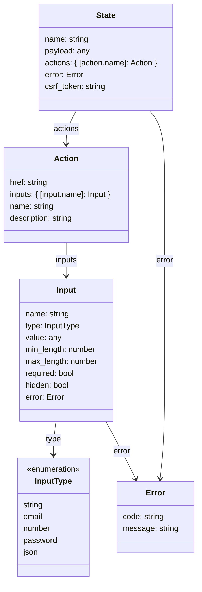

<div style={{display: 'none'}}>
# Hanko Flow API Understanding Guide

**About Hanko**: Hanko is a passwordless authentication solution that enables secure, modern user authentication experiences. The Flow API is a state-driven system that simplifies frontend development by managing authentication flow logic on the backend, reducing frontend complexity and making flows more maintainable.

**What This Guide Covers**: This guide explains the fundamental concepts behind the Hanko Flow API, including how states and actions work, how to initialize and interact with flows, handle validation and technical errors, and configure flow behavior for your applications.

**Key Technologies**: Hanko Flow API, REST endpoints, JavaScript/TypeScript, state-driven architecture, JSON request/response handling, CSRF protection, client-server communication

**Prerequisites**: Basic understanding of REST APIs, HTTP requests and responses, JSON data format, client-side JavaScript development, authentication flow concepts

**Tasks You'll Complete**:
- Understand the Flow API's state-driven architecture
- Learn about states, actions, and input validation system
- Master flow initialization with POST requests
- Implement proper action execution with input data
- Handle validation errors and user feedback
- Manage technical errors and flow recovery
- Configure flows for different authentication scenarios
- Apply best practices for Flow API integration
</div>

## Introduction

The Flow API simplifies frontend development by moving authentication flow logic to the backend. Traditional authentication implementations require frontends to manage complex state transitions, predict next steps, and handle various configuration options. This complexity increases maintenance overhead and makes configuration changes difficult.

The Flow API solves this by maintaining all authentication state on the backend. Your frontend only needs to render the current state and execute available actions, without tracking user inputs or predicting what comes next.

Key takeaways include:

1. **State-Driven Flow:** Each API response represents a state, which determines the available actions and required user inputs.
2. **Dynamic Input Validation:** Inputs come with metadata for client-side validation, while the backend ensures robust validation.
3. **Error Handling:** Detailed error annotations in responses guide the frontend in displaying actionable feedback to users.

## **Understanding States and Actions**

Every Flow API response contains all information needed to render the appropriate UI. Each response represents a specific `state` in the authentication flow, and each state defines available `actions` that users can perform.

Your frontend implementation requires a handler function for each possible state. When you receive a new response from the backend, the corresponding handler processes it and renders the UI based on the available actions.

Each action includes:
- **inputs**: Defines what data to collect from the user
- **validation rules**: Specifies requirements for input values  
- **execution URL**: The endpoint to send the action request to

To execute an action, send a POST request to the action's URL with the collected input data. The backend processes the action and returns the next state.

Some responses include a `payload` with additional data specific to that state, such as user information or configuration details needed for UI rendering.

The diagram shows the structure of a flow response:

<Frame>

</Frame>

## Initializing Flows

The Flow API supports three main flows, each initialized with an empty `POST` request:
- `/login` - User authentication flow
- `/registration` - User registration flow  
- `/profile` - User profile management flow

Refer to the [Flow API documentation](https://docs.hanko.io/api-reference/flow) for complete details on available states and actions in each flow.

This guide uses an example `/example-flow` endpoint to demonstrate the concepts. Here's how to initialize and work with any flow:

<Steps>
  <Step title={"Initialize a New Flow"}>
    Send an empty `POST` request to the the flow URL, `/example-flow` in this example.
  </Step>
  <Step title={"Obtain the Response Body"}>
    When the API successfully created a new flow, the response will look like this:
    ```json
    {
      "name": "example-state",
      "status": 200,
      "csrf_token": "a-random-token",
      "actions": {
        "example-action": {
          "action": "example-action",
          "description": "This action is an example.",
          "href": "/example-flow?action=example-action@example-flow-id",
          "inputs": {
            "example-input-field": {
              "name": "example-input-field",
              "type": "string",
              "minLength": 16,
              "maxLength": 32,
              "required": true,
              "hidden": false
            }
          }
        }
      }
    }
    ```
    <Note>
      The response object represents a state called ‘example-state’. It includes a single action, 'example-action'.
    </Note>
  </Step>
</Steps>

## Interacting with Flows

After receiving a flow response, you process the current state by calling the appropriate handler function. This handler renders the UI based on the state and available actions.

```js
  const state = await fetch(...)

  switch (state.name) {
    case "example-state":
      // Render a page that represents the 'example-state', containing a
      // string input field, where the user can enter a value for the
      // 'example-input-field' (see previous section).
      break;
    // Add more cases for different states.
    default:
      console.log(`Missing handler for state: ${state.name}`);
  }
```

To execute an action, collect the input values from your form and create a request body with the structure shown in the diagram:

<Frame>
  ```mermaid
  classDiagram
      class ActionExecutionRequest {
          input_data: #123; [input.name]: any #125;
          csrf_token: string
      }
  ```
</Frame>

According to the example reponse object, we would proceed as follows to execute the 'example-action':

<Steps>
  <Step title={"Generate the Request Object"}>
    Let’s assume that we’ve obtained an input value 'example input value' for the input
    field 'example-input-field'. The request body to be generated would look like this:
    ```json
    {
        "input_data": {
            "example-input-field": "example input value"
        },
        "csrf_token": "a-random-token"
    }
    ```
    <Tip>
      Note that the `csrf_token` from the previous state must be included in each request.
    </Tip>
  </Step>
  <Step title={"Execute the Action"}>
    Send the object via a `POST` request to the `href` provided by the action. In this case, the `href` is
    `/example-flow?action=example-action@example-flow-id`.
  </Step>
  <Step title={"Obtain the Response Body"}>
    When the request was successful, you receive an object in the
    same manner, representing the next state:
    ```json
    {
      "name": "next-state",
      "status": 200,
      "csrf_token": "a-new-random-token",
      "actions": { ... } // a new set of available actions
    }
    ```
  </Step>
</Steps>

## Handling Validation Errors

The Flow API includes detailed validation metadata for each input field, such as minimum and maximum length requirements (`min_length` and `max_length`). While you can implement client-side validation using this metadata, the backend always performs final validation and returns detailed error information when validation fails:

<Steps>
  <Step title={"Send Invalid Input Values"}>
    Let’s assume that we’ve generated an invalid value for ‘example-input-field’:
    ```json
    {
        "input_data": {
            "example-input-field": "too short" // less than 16 characters
        },
        "csrf_token": "a-random-token"
    }
    ```
  </Step>
  <Step title={"Execute the Action"}>
    Send the object via a `POST` request to the `href` provided by the action. Again, the `href` would be
    `/example-flow?action=example-action@example-flow-id`.
  </Step>
  <Step title={"Obtain the Response Body"}>
    The API would return an object representing the same state, ‘example-state’, but with error annotations indicating
    the validation issue:
    ```json
    {
      "name": "example-state",
      "status": 400,
      "csrf_token": "a-random-token",
      "error": {
        "code": "form_data_invalid_error",
        "message": "Form data invalid."
      },
      "actions": {
        "example-action": {
          "action": "example-action",
          "description": "This action is an example.",
          "href": "/example-flow?action=example-action@example-flow-id",
          "inputs": {
            "example-input-field": {
              "name": "example-input-field",
              "type": "string",
              "minLength": 16,
              "maxLength": 32,
              "required": true,
              "hidden": false,
              "error": {
                "code": "value_too_short_error",
                "message": "The value is too short."
              }
            }
          }
        }
      }
    }
    ```
    <Note>
      As you can see, the `status` field has changed to ‘400’ (Bad Request), indicating that the request was invalid. A
      global error object has been added with the `code` ‘form_data_invalid_error’ and the `message`
      ‘Form data invalid’. Additionally, the invalid input field now includes an error object with the `code`
      ‘value_too_short_error’, and the `message` ‘The value is too short’.
    </Note>
  </Step>
</Steps>

## Handling Technical Errors

Technical errors (non-4xx HTTP errors) result in an error state that indicates the flow cannot continue. These typically occur due to server issues, network problems, or system failures. Here's how such responses appear:

```json
{
    "name": "error",
    "status": 500,
    "error": {
        "code": "technical_error",
        "message": "Something went wrong."
    }
}
```

When you encounter an error state, display the error message to the user and provide an option to restart the authentication process by initializing a new flow.

## Configuring Flows

Flow behavior is highly configurable to match your application's requirements:

- **Hanko Cloud users**: Configure flows through the [Hanko Console](https://cloud.hanko.io/)
- **Self-hosted users**: Use the [configuration reference](https://github.com/teamhanko/hanko/wiki/config)

Your configuration determines which states and actions are available in each flow. Different configurations can enable or disable specific authentication methods, require additional verification steps, or change the overall flow structure.

When building custom UIs, you have two approaches:
1. **Full support**: Implement handlers for all possible states and actions to support every available feature
2. **Selective support**: Configure your Hanko project to disable unused features and implement only the handlers you need

After making configuration changes, always test your application thoroughly and add any missing state handlers to ensure proper functionality.

## Conclusion and Outlook

This guide has shown you the core concepts of the Flow API through practical examples:

- **Initialize flows** with empty POST requests to flow endpoints
- **Interpret responses** by understanding states, actions, and input requirements  
- **Execute actions** by collecting user input and sending proper request payloads
- **Handle validation errors** with detailed field-level error information
- **Manage technical errors** by implementing proper error recovery flows

For complete details on available states and actions in each flow, consult the [Flow API documentation](https://docs.hanko.io/api-reference/flow). The Flow API continues to evolve with additional features and improved tooling to make authentication integration even simpler.