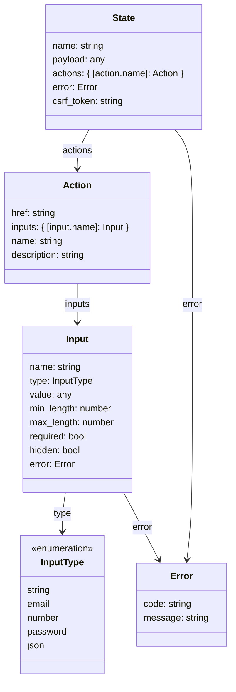

## Introduction

The FlowAPI was introduced to streamline the development of frontend applications. Since Hanko version 1.0, the backend
provides extensive options to configure authentication or profile flows. These options, combined with dynamic user inputs
that can alter the flow and available actions, increase the complexity of the frontend logic and changes to the flow
configuration may require major adjustments.

The Hanko API aims to address this issue by maintaining the user state, thus eliminating the need for the frontend to
remember specific user inputs or predict subsequent actions.

Key takeaways include:

1. **State-Driven Flow:** Each API response represents a state, which determines the available actions and required user inputs.
2. **Dynamic Input Validation:** Inputs come with metadata for client-side validation, while the backend ensures robust validation.
3. **Error Handling:** Detailed error annotations in responses guide the frontend in displaying actionable feedback to users.

## **Understanding States and Actions**

Every FlowAPI response contains the necessary information, to render a matching UI. A flow response represents a `state`
within the flow. A state contains `actions`, that specify what actions can be performed at that point.

To build a frontend application, you would implement a handler function for each possible state in the flow. When a new
response is received from the backend, the corresponding handler processes it, typically rendering a new page based on
the available actions.

Each action includes `inputs`, which defines the data to be collected, as well as validation rules for the input values.
To execute an action, the frontend sends a new request to the backend using the URL provided by the action object, along
with the collected input data. This is described in the following sections.

Additionally, a response may include a `payload` depending on the specific `state`. This payload could, for example,
contain a user object or other information useful for constructing the UI.

The diagram shows the structure of a flow response:

<Frame>

</Frame>

## Initializing Flows

Currently, three different flows can be initialized by sending an empty `POST` request to one of the following endpoints:
`/login`, `/registration`, or `/profile`. Refer to the [documentation](https://docs.hanko.io/api-reference/flow) to learn about the states and actions available in each flow.

For this guide, we’ll assume there is a fourth flow available at the `/example-flow` endpoint. To initialize this flow,
send a `POST` request to `/example-flow`. The response will look as follows:

<Steps>
  <Step title={"Initialize a New Flow"}>
    Send an empty `POST` request to the the flow URL, `/example-flow` in this example.
  </Step>
  <Step title={"Obtain the Response Body"}>
    When the API successfully created a new flow, the response will look like this:
    ```json
    {
      "name": "example-state",
      "status": 200,
      "csrf_token": "a-random-token",
      "actions": {
        "example-action": {
          "action": "example-action",
          "description": "This action is an example.",
          "href": "/example-flow?action=example-action@example-flow-id",
          "inputs": {
            "example-input-field": {
              "name": "example-input-field",
              "type": "string",
              "minLength": 16,
              "maxLength": 32,
              "required": true,
              "hidden": false
            }
          }
        }
      }
    }
    ```
    <Note>
      The response object represents a state called ‘example-state’. It includes a single action, 'example-action'.
    </Note>
  </Step>
</Steps>

## Interacting with Flows

When a new flow response has been received, you would call a handler to process the current state, that renders a UI
containing a form with an input field 'example-input-field'.

```js
  const state = await fetch(...)

  switch (state.name) {
    case "example-state":
      // Render a page that represents the 'example-state', containing a
      // string input field, where the user can enter a value for the
      // 'example-input-field' (see previous section).
      break;
    // Add more cases for different states.
    default:
      console.log(`Missing handler for state: ${state.name}`);
  }
```

To submit the form or perform the action respectively, we need
to obtain the value of the input field and generate a request body that looks as shown in the diagram:

<Frame>
  ```mermaid
  classDiagram
      class ActionExecutionRequest {
          input_data: #123; [input.name]: any #125;
          csrf_token: string
      }
  ```
</Frame>

According to the example reponse object, we would proceed as follows to execute the 'example-action':

<Steps>
  <Step title={"Generate the Request Object"}>
    Let’s assume that we’ve obtained an input value 'example input value' for the input
    field 'example-input-field'. The request body to be generated would look like this:
    ```json
    {
        "input_data": {
            "example-input-field": "example input value"
        },
        "csrf_token": "a-random-token"
    }
    ```
    <Tip>
      Note that the `csrf_token` from the previous state must be included in each request.
    </Tip>
  </Step>
  <Step title={"Execute the Action"}>
    Send the object via a `POST` request to the `href` provided by the action. In this case, the `href` is
    `/example-flow?action=example-action@example-flow-id`.
  </Step>
  <Step title={"Obtain the Response Body"}>
    When the request was successful, you receive an object in the
    same manner, representing the next state:
    ```json
    {
      "name": "next-state",
      "status": 200,
      "csrf_token": "a-new-random-token",
      "actions": { ... } // a new set of available actions
    }
    ```
  </Step>
</Steps>

## Handling Validation Errors

The API provides validation details, such as ensuring that the value is between 16 and 32 characters long (`min_length`
and `max_length`). You can validate the input data client-side before sending it, but backend validation will handle any
errors if necessary:

<Steps>
  <Step title={"Send Invalid Input Values"}>
    Let’s assume that we’ve generated an invalid value for ‘example-input-field’:
    ```json
    {
        "input_data": {
            "example-input-field": "too short" // less than 16 characters
        },
        "csrf_token": "a-random-token"
    }
    ```
  </Step>
  <Step title={"Execute the Action"}>
    Send the object via a `POST` request to the `href` provided by the action. Again, the `href` would be
    `/example-flow?action=example-action@example-flow-id`.
  </Step>
  <Step title={"Obtain the Response Body"}>
    The API would return an object representing the same state, ‘example-state’, but with error annotations indicating
    the validation issue:
    ```json
    {
      "name": "example-state",
      "status": 400,
      "csrf_token": "a-random-token",
      "error": {
        "code": "form_data_invalid_error",
        "message": "Form data invalid."
      },
      "actions": {
        "example-action": {
          "action": "example-action",
          "description": "This action is an example.",
          "href": "/example-flow?action=example-action@example-flow-id",
          "inputs": {
            "example-input-field": {
              "name": "example-input-field",
              "type": "string",
              "minLength": 16,
              "maxLength": 32,
              "required": true,
              "hidden": false,
              "error": {
                "code": "value_too_short_error",
                "message": "The value is too short."
              }
            }
          }
        }
      }
    }
    ```
    <Note>
      As you can see, the `status` field has changed to ‘400’ (Bad Request), indicating that the request was invalid. A
      global error object has been added with the `code` ‘form_data_invalid_error’ and the `message`
      ‘Form data invalid’. Additionally, the invalid input field now includes an error object with the `code`
      ‘value_too_short_error’, and the `message` ‘The value is too short’.
    </Note>
  </Step>
</Steps>

## Handling Technical Errors

Other (non-4xx) errors may result in an error state, indicating that the flow cannot proceed any further, such as in the
case of a technical issue. A response in such a scenario might look like this:

```json
{
    "name": "error",
    "status": 500,
    "error": {
        "code": "technical_error",
        "message": "Something went wrong."
    }
}
```

In this situation, an error message should be displayed in the UI, providing the user with the option to initialize a
new flow.

## Configuring Flows

If you are a Hanko Cloud user, you can configure the behavior of the flows via the [Hanko Console](https://cloud.hanko.io/).
Self-hosted users are advised to consult the [configuration reference](https://github.com/teamhanko/hanko/wiki/config).

Depending on the flow configuration, the individual flows can traverse various states, and certain actions or action inputs
may be available or unavailable.

If you're building your own UI and aim to support every feature of the currently available flows, your implementation
must include a handler for each possible state and action. If you only want to support specific states or actions, ensure
that you configure your Hanko project to disable any features you don't need. After making configuration changes, verify
that your application remains functional and add missing handlers as needed.

## Conclusion and Outlook

This guide has demonstrated, with examples, how to:

- initialize a new flow
- interpret the flow response
- execute a flow action
- handle errors

For details on how different "states" in the flows look, please refer to the [documentation](https://docs.hanko.io/api-reference/flow). Also note that a cross-platform SDK designed to simplify frontend integration will be released soon.